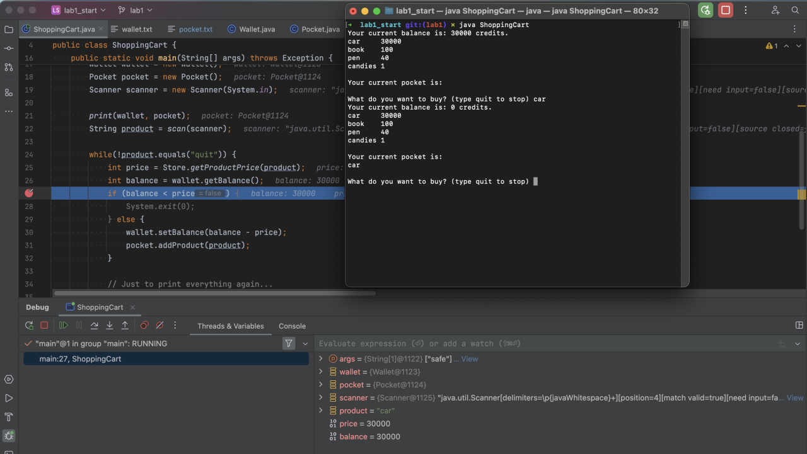
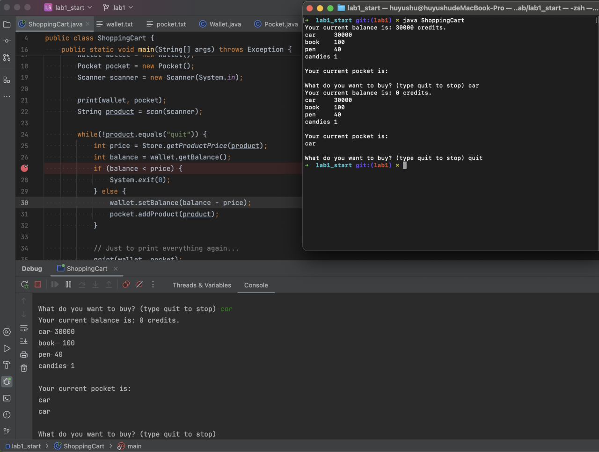

# Report

## Part 0

To run, execute the command below in terminal:

- If not the first time, `make resetFiles` to reset the wallet and pocket.

- `make all` to compile.

- `java ShoppingCart [unsafe | safe]` to execute the program with unsafe/safe APIs.

## Part 1

1. The shared resources are `wallet.txt` and `pocket.txt`. These files are shared by all running instance of the shopping cart program (multi-threaded / multi-process clients).
2. The root problem is a TOCTOU race condition in the purchase progress. Checking and updating the balance are performed separately, which allows interleaving updates across threads/processes.

3. The check and use operations are not atomic, so we can attack the program by running multiple instances of ShoppingCart and introducing a delay between these two operations. This causes the price to be deducted only once or inconsistently so that the user can get a car but paying less than its value. 
To achieve the delay, we use breakpoints to delay the IDE's balance check.
4. When debugging a program in an IDE while simultaneously running a Java program in the terminal, use breakpoint to ensure that the instances reach the balance check and read the same balance.
   The terminal inputs the command to purchase a car, both instances will initially pass the balance check since they read the original balance. The IDE's execution resumes afterward, it will still proceed with adding the product to the pocket based on the outdated balance.
   As a result, the original 30,000 balance ends up purchasing two cars.

## Part 2

1. Resource `pocket.txt` (APIs `pocket.addProduct()` and `pocket.getPocket()`) is also vulnerable to potential read/write and write/write race conditions. One instance could be reading the file while another is writing, causing inconsistent results. 
Also, when multiple concurrent requests attempt to add products to the pocket file, simultaneous writes can lead to overwriting or data inconsistencies. Each operation on the shared file is performed independently without any locking or coordination, allowing interleaved execution that may corrupt the final state of the file.
2. To fix APIs, implement `Wallet.safeWithdraw()` method with the necessary protections -- add file lock around operations that modify `wallet.txt`, ensuring that only one thread or process can modify the wallet at any given time. Similarly, add file lock in methods that modify `pocket.txt`.
3. The applied protection is minimally sufficient and avoids excessive synchronization because:  
We lock only the file, and only for the shortest necessary duration of the critical I/O sections, not the entire request lifecycle.
It fully protects against multiprocessing-based TOCTOU attacks where `synchronized` or `static lock` in Java would be ineffective as it can only protect against multithreading-based attacks.  
By applying synchronization only to specific operations that manipulate shared resources to make those critical operations atomic, we avoid potential TOCTOU attacks and minimize performance overhead.

The attack by using the breakpoint from Part 1 now fails.
